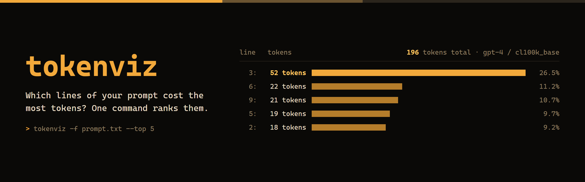
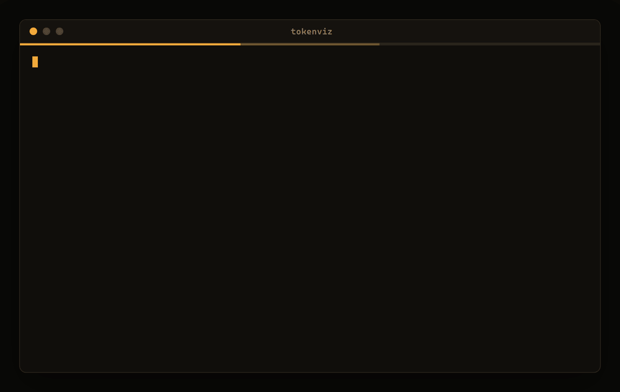

<p align="center"></p>

# tokenviz

**Tells you which lines of your prompt use the most tokens, heaviest first, so you know what to trim.**

<p align="center"></p>

### Which one do I want?

This repo has a sibling, [Token-Visualizer](https://github.com/Mattbusel/Token-Visualizer). Both count tokens with OpenAI's `tiktoken`; they answer different questions.

| You want to... | Use |
| --- | --- |
| Rank the lines of a prompt by token cost, see the top N, filter by size | **tokenviz** (this one) |
| Fail a CI job or script when a prompt goes over a token budget, or get JSON | **tokenviz** (`--budget`, `--json`) |
| See the exact token boundaries, one colored chip per token | [Token-Visualizer](https://github.com/Mattbusel/Token-Visualizer) |
| Get suggestions for wordy phrases and the measured token savings | [Token-Visualizer](https://github.com/Mattbusel/Token-Visualizer) |
| Count with a Hugging Face tokenizer (Llama, BERT, ...) | [Token-Visualizer](https://github.com/Mattbusel/Token-Visualizer) (from source, with `transformers`) |

## Install

| Platform | Command |
| --- | --- |
| macOS / Linux (Homebrew) | `brew install mattbusel/tap/tokenviz` |
| Windows (Scoop) | `scoop bucket add mattbusel https://github.com/Mattbusel/scoop-bucket; scoop install mattbusel/tokenviz` |
| macOS / Linux (script) | `curl -fsSL https://raw.githubusercontent.com/Mattbusel/tokenviz/main/install.sh \| sh` |
| Windows (PowerShell script) | `irm https://raw.githubusercontent.com/Mattbusel/tokenviz/main/install.ps1 \| iex` |
| Any OS with Python 3.8+ | `pipx install git+https://github.com/Mattbusel/tokenviz` |
| Manual download | [Latest release](https://github.com/Mattbusel/tokenviz/releases/latest): Windows zip, macOS (Apple Silicon or Intel) and Linux tarballs |

The downloads are single files with the tokenizer data built in, so they work offline. The two scripts check the SHA-256 against the release's `SHA256SUMS.txt` before installing: `install.sh` puts `tokenviz` in `~/.local/bin`, `install.ps1` puts `tokenviz.exe` in `%LOCALAPPDATA%\Programs\tokenviz` and adds it to your user PATH.

Do not `pip install tokenviz`: that name on PyPI is a different, unrelated package.

<details><summary>Unsigned binary warnings</summary>

Windows SmartScreen may say "unknown publisher": click **More info**, then **Run anyway**. On macOS, if a manually downloaded binary is blocked, right-click it and choose **Open** the first time, or run `xattr -d com.apple.quarantine tokenviz`. Homebrew, Scoop and the install scripts do not trigger this.
</details>

## Use it in 3 steps

1. **Point it at a prompt.** A file, a quoted string, or a pipe:
   ```bash
   tokenviz -f prompt.txt
   tokenviz "Summarize this email in one sentence."
   cat prompt.txt | tokenviz
   ```
   You see the total token count, then every non-empty line with its tokens, a bar scaled to the heaviest line, and its share of the total. Lines over 50 tokens are yellow, over 100 red.

2. **Zoom in on the expensive part.**
   ```bash
   tokenviz -f prompt.txt --top 5          # the five heaviest lines
   tokenviz -f prompt.txt --threshold 20   # only lines over 20 tokens
   tokenviz -f prompt.txt -m gpt-4o        # GPT-4o's tokenizer (o200k_base)
   ```

3. **Guard it in CI or a script.**
   ```bash
   tokenviz -f prompt.txt --budget 2000    # exit code 3 if over 2000 tokens
   tokenviz -f prompt.txt --json           # machine-readable
   ```

## Results

This is real output from today, for [`examples/system-prompt.txt`](examples/system-prompt.txt) (a 10-line bookkeeping-assistant prompt):

```text
$ tokenviz -f examples/system-prompt.txt --top 3 --budget 150

Token Analysis  model gpt-4, encoding cl100k_base
Total tokens: 196   across 10 non-empty lines
Total lines analyzed: 3

Line breakdown  heaviest first; yellow > 50 tokens, red > 100
────────────────────────────────────────────────────────────────────────────────────────────────
  3:   52 tokens | ████████████████ |  26.5% | When the user pastes a bank statement, group ...
  6:   22 tokens | ███████          |  11.2% | Never give tax advice. If asked, say you can ...
  9:   21 tokens | ██████           |  10.7% | If the statement is cut off or unreadable, sa...
────────────────────────────────────────────────────────────────────────────────────────────────

Stats:
  Average tokens per line: 31.7
  Most tokens in a line:   52
  Fewest tokens in a line: 21
  Tokens in the lines shown: 95 of 196 total

Over budget: 196 tokens > 150 (exit code 3)
```

One line of ten is more than a quarter of the prompt. That is the line to rewrite first.

<details><summary>All options</summary>

```text
Usage: tokenviz [OPTIONS] [TEXT]

  Count the tokens in a prompt and rank its lines by token cost.

Options:
  -f, --file FILE             Read input from a file
  -m, --model TEXT            Model to use for tokenization (gpt-4, gpt-4o,
                              gpt-3.5-turbo, etc.)  [default: gpt-4]
  -t, --top INTEGER RANGE     Show only the top N lines with most tokens
  --threshold INTEGER RANGE   Only show lines with more than N tokens
  -b, --budget INTEGER RANGE  Exit with code 3 if the whole input is over N
                              tokens (for CI and scripts)
  --json                      Print machine-readable JSON instead of the chart
  --no-color                  Disable colors (NO_COLOR is also respected)
  -V, --version               Show the version and exit.
  -h, --help                  Show this message and exit.
```

- The model name picks the tiktoken encoding. Unknown names fall back to the GPT-4 encoding (`cl100k_base`) with a warning on stderr.
- Exit codes: `0` ok, `1` no input or unreadable file, `2` bad option, `3` over `--budget`.
- `--json` prints `model`, `encoding`, `total_tokens`, `lines_total`, `budget`, `over_budget` and the shown `lines` (`line`, `tokens`, `text`). With `--budget` it still exits 3 when over.
- Colors are on in a terminal and off in a pipe; `--no-color` or `NO_COLOR=1` turns them off, `FORCE_COLOR=1` keeps them on in a pipe. The layout fits the terminal width.
- Token counts are per line, so the line counts can add up to slightly less or more than the whole-text total (newlines are tokens too, and merges can cross line breaks).
</details>

<details><summary>Use in GitHub Actions</summary>

```yaml
- name: Keep the system prompt under 2,000 tokens
  run: |
    curl -fsSL https://raw.githubusercontent.com/Mattbusel/tokenviz/main/install.sh | sh
    ~/.local/bin/tokenviz -f prompts/system.txt --budget 2000 --top 5
```
</details>

<details><summary>From source, and the layout of this repo</summary>

```bash
git clone https://github.com/Mattbusel/tokenviz
cd tokenviz
pip install -e ".[dev]"
pytest
python -m tokenviz -f examples/system-prompt.txt
```

```
pyproject.toml            packaging, the `tokenviz` console script
tokenviz/cli.py           the click command: counting, ranking, bars, --budget, --json
tokenviz/__main__.py      python -m tokenviz (and the PyInstaller entry point)
examples/                 the prompt used in the demo above
tests/                    pytest suite, run by CI on Linux and Windows
install.sh, install.ps1   the one-line installers
packaging/winget/         winget manifests (not yet submitted)
```
</details>

## License

MIT
